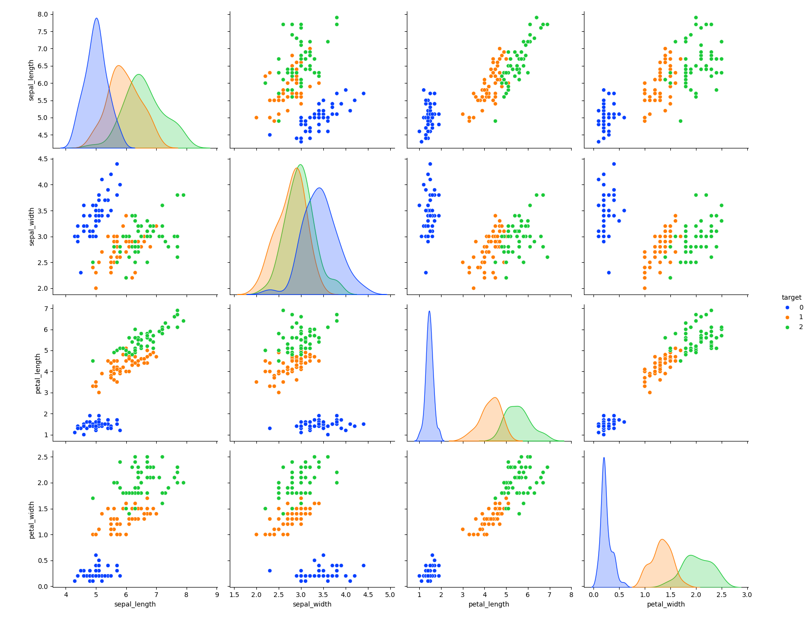
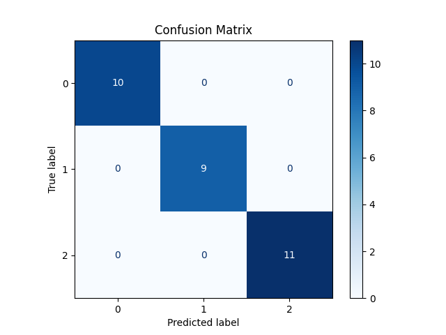

# **Iris Classification**

## **Overview**
This project implements a **classification model** to predict the species of Iris flowers based on their **sepal and petal measurements**. The model achieves **perfect accuracy (100%) on the test set**, demonstrating its effectiveness in distinguishing between the three Iris species.  

Below is a **pairplot visualization** of the Iris dataset, illustrating feature relationships across different species:

---

## **Dataset**
The **Iris dataset** is a well-known benchmark dataset in machine learning, containing **150 samples** from three species:  
- **Iris Setosa**  
- **Iris Versicolor**  
- **Iris Virginica**  

Each sample includes four features:  
- **Sepal Length**  
- **Sepal Width**  
- **Petal Length**  
- **Petal Width**  

These features allow classification models to distinguish between species with high accuracy.  

### **Class Label Mapping:**

| Label | Species          |
|--------|-----------------|
| **0** | Iris Setosa     |
| **1** | Iris Versicolor |
| **2** | Iris Virginica  |

---

## **Model Details**
The model is implemented using a **neural network-based classifier** with the following hyperparameters:  

- **Epochs:** 1000  
- **Learning Rate:** 0.01 (1e-2)  

After training, the model achieves:  
- **Training Accuracy:** **0.958 (95.8%)**  
- **Test Accuracy:** **1.000 (100%)**  

---

## **Results**

### **Confusion Matrix**
The **confusion matrix** illustrates the model’s performance on the test set:

This matrix shows that **all test samples were classified correctly**, with **zero misclassifications**.

---

### **Classification Report**
The detailed performance metrics for each class are summarized below:

| Class | Precision | Recall | F1-score | Support |
|-------|-----------|--------|----------|---------|
| **0** (Setosa)      | 1.00 | 1.00 | 1.00 | 10 |
| **1** (Versicolor)  | 1.00 | 1.00 | 1.00 | 9  |
| **2** (Virginica)   | 1.00 | 1.00 | 1.00 | 11 |
| **Overall Accuracy** | **1.00 (100%)** | | |

**Metric Explanations:**  
- **Precision:** Measures how many predicted positive instances were correct.  
- **Recall (Sensitivity):** Measures how many actual positive instances were correctly identified.  
- **F1-score:** The harmonic mean of precision and recall, balancing both metrics.  
- **Support:** The number of samples per class in the dataset.  

Since **all precision, recall, and F1-scores are 1.00**, the model achieves a **perfect classification** on the test set.

---

## **Next Steps & Potential Improvements**
Although the model performs exceptionally well, potential next steps include:
1. **Testing with different train-test splits** to confirm generalization.  
2. **Using cross-validation** for robustness verification.  
3. **Feature importance analysis** to determine which measurements contribute most to predictions.  
4. **Applying the model to real-world datasets** to assess performance beyond the Iris dataset.  

---

### **Conclusion**
This project successfully implemented a **highly accurate classifier** for the Iris dataset, achieving **perfect accuracy** on the test set. The results indicate that the dataset is well-structured and that the model effectively captures feature patterns to distinguish between species.

